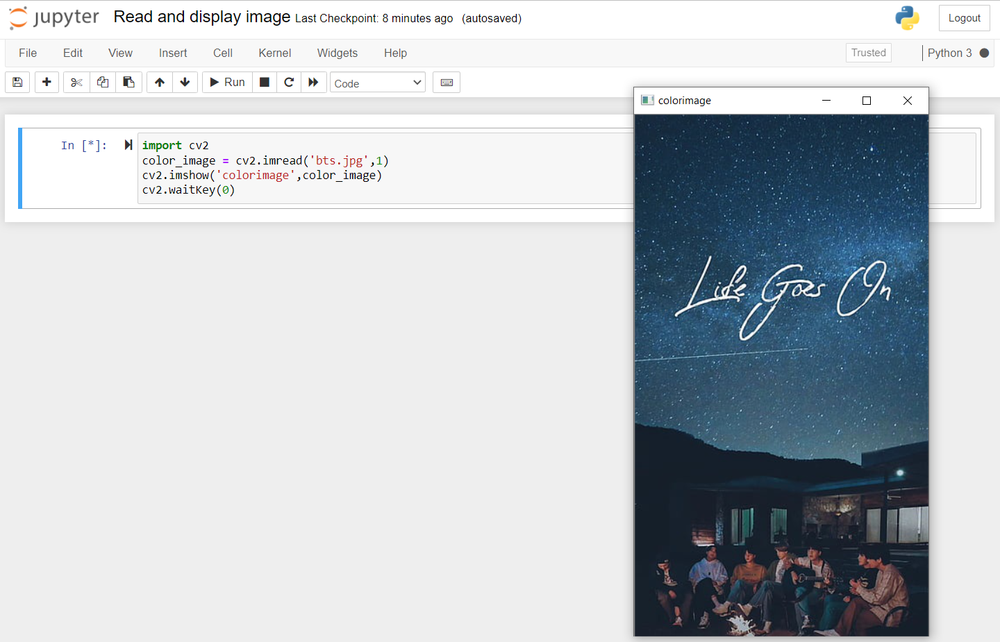
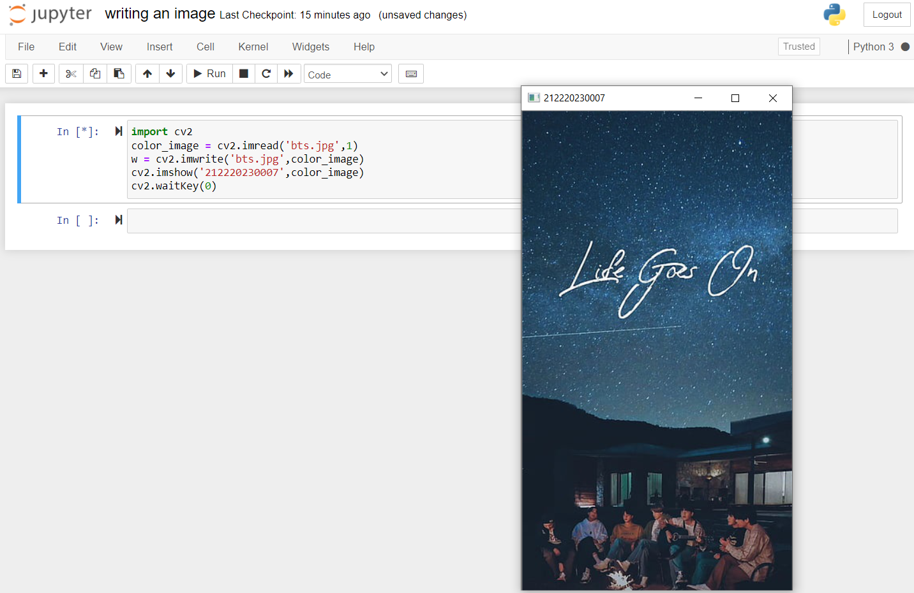
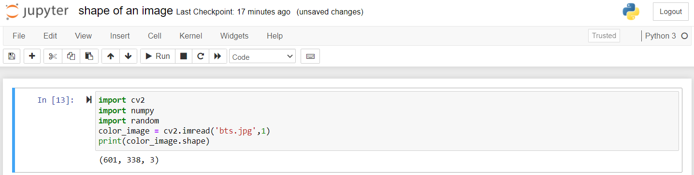
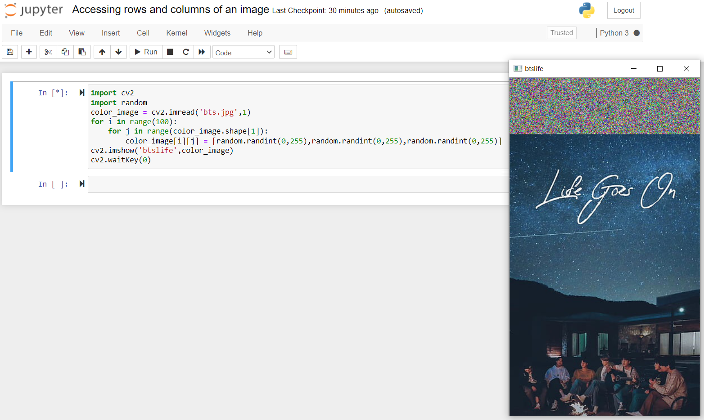
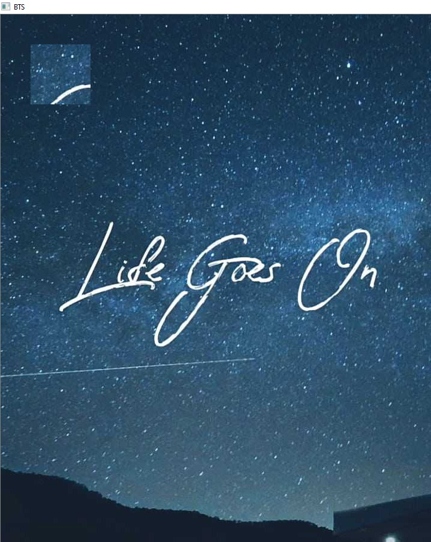

# READ AND WRITE AN IMAGE
## AIM
To write a python program using OpenCV to do the following image manipulations.
i) Read, display, and write an image.
ii) Access the rows and columns in an image.
iii) Cut and paste a small portion of the image.

## Software Required:
Anaconda - Python 3.7
## Algorithm:
### Step1:
Choose an image and save it as a filename.jpg
### Step2:
Use imread(filename, flags) to read the file.
### Step3:
Use imshow(window_name, image) to display the image.
### Step4:
Use imwrite(filename, image) to write the image.
### Step5:
End the program and close the output image windows.
## Program:
### Developed By:
B.KAVYA
### Register Number:
212220230007
 
# To Read,display the image
```
  import cv2
  color_image = cv2.imread('bts.jpg',1)
  cv2.imshow('colorimage',color_image)
  cv2.waitKey(0)

```
# To write the image
```
  import cv2
  color_image = cv2.imread('bts.jpg',1)
  w = cv2.imwrite('bts.jpg',color_image)
  cv2.imshow('212220230007',color_image)
  cv2.waitKey(0)

```
# Find the shape of the Image
```
  import cv2
  import random
  color_image = cv2.imread('bts.jpg',1)
  print(color_image.shape)

```
# To access rows and columns

```
  import cv2
  import random
  color_image = cv2.imread('bts.jpg',1)
  for i in range(100):
    for j in range(color_image.shape[1]):
        color_image[i][j] = [random.randint(0,255),random.randint(0,255),random.randint(0,255)]
  cv2.imshow('btslife',color_image)
  cv2.waitKey(0)

```
# To cut and paste portion of image
```
import cv2
color_image = cv2.imread('bts.jpeg',-1)
tag = color_image[300:400,300:400]
color_image[50:150,50:150] = tag
cv2.imshow('BTS',color_image)
cv2.waitKey(0)

```

## Output:

### i) Read and display the image

<br>
<br>

### ii)Write the image

<br>
<br>

### iii)Shape of the Image

<br>
<br>

### iv)Access rows and columns

<br>
<br>

### v)Cut and paste portion of image

<br>
<br>

## Result:
Thus the images are read, displayed, and written successfully using the python program.


